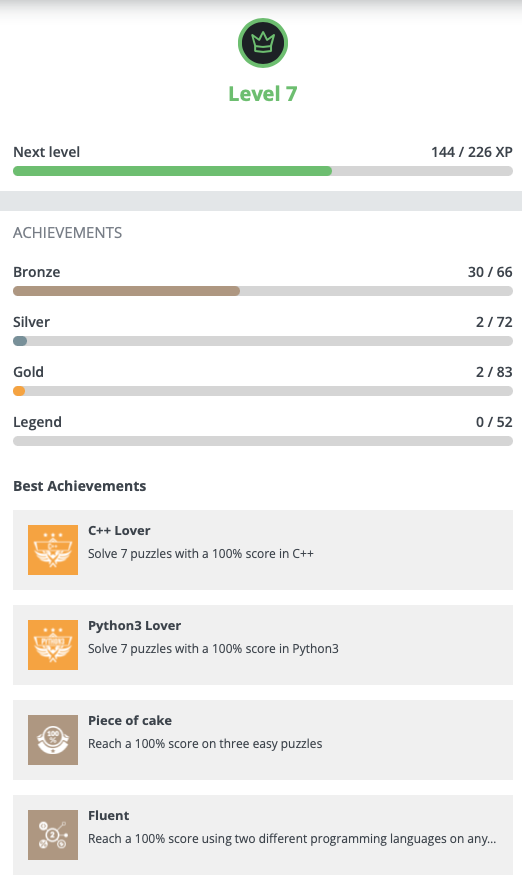

# 👋 Hi there, welcome to my personal corner

My name is Minh, but you can call me **Mine** – and no, it is not about ownership.

The name **Mine** is a shortcut for _“Minh nè”_, which roughly means **“Hey, I am Minh!”**, a cheeky and playful way of introducing myself in Vietnamese.

###### I prefer it pronounced as */Mi-ne/*, rather than */Mi-nə/* or */Min/* (yes, that small detail matters, lol).

## 🌟 Featured Projects

  
  &nbsp;&nbsp;&nbsp;
  

## ✨ Fun Facts
- I love clean code, optimization and algorithms
- I debug with matcha 🍵
- Favorite challenge: making `C++` templates behave nicely 😅

So, take a cup of matcha 🍵, explore freely, and maybe you will discover something interesting, or at least slightly optimized.

## 🧑‍💻 Skills

| Programming | OS | Domain | Tools | Others |
|------------|----|--------|-------|--------|
|    |   |     |     |    

---

## 🎮 Coding Platforms

  
  &nbsp;&nbsp;&nbsp;
  
  &nbsp;&nbsp;&nbsp;
  

## 📊 Stats

<table align="center">
  <tr>
    <td align="center" valign="top">
      
    </td>
    <td align="center" valign="top">
      
    </td>
  </tr>
</table>

## 📝 Publications

| Year | Type           | Title                        | Venue           | Link                           |
| ---- | -------------- | ---------------------------- | --------------- | ------------------------------ |
| 2025 | Thesis        | Numerical optimization for large scale mechanical problems : Friction and plasticity     | HAL archive   | [PDF](https://theses.hal.science/tel-05219416v1)     |
| 2024 | Conference Presentation     | An interior-point approach to solving friction contact problems in hyperstatic scenarios    | CMIS Lyon            | [Abstract](https://cmis2024.sciencesconf.org/data/pages/CMIS_2024_Livret_final_v2_.pdf#page=54)    |
| 2024 | Journal Paper     | Second-order cone programming for frictional contact mechanics using interior point algorithm    | OMS            | [Cite](https://www.tandfonline.com/doi/epdf/10.1080/10556788.2023.2296438?needAccess=true) [PDF](https://hal.science/hal-03913568/document)     |
| 2023 | Conference Presentation     | Interior point methods for computing frictional contact problems with hyperstaticity    | ICCCM Torino            | [Abstract](https://conference.unisalento.it/ocs/public/conferences/40/fmgr_upload/documentation/ICCCM2023_Book_of_abstracts.pdf?v=2#page=71)    |
| 2022 | Conference Paper         | High-accuracy Computation of Rolling Friction Contact Problems | IEEE NICS | [Cite](https://ieeexplore.ieee.org/abstract/document/10013388) [PDF](https://inria.hal.science/hal-03741048v1/document)           |
| 2022 | Conference Poster | Second-order cone programming for rolling friction contact mechanics             | SMAI MODE Limoges          | [PDF](https://inria.hal.science/hal-03761228/document) |

## 🎓 Education

- **Ph.D. in Applied Mathematics**, [TRIPOP team](https://team.inria.fr/tripop/) at INRIA and Jean Kuntzmann Laboratory, University of Grenoble-Alpes, France, 2025.
- **M.Sc. in Applied Mathematics**, University of Limoges, France, 2021.
- **B.Sc. in Computer Engineering (ABET-accredited)**, Vietnam National University, Ho Chi Minh City University of Technology (HCMUT), Vietnam, 2015.
