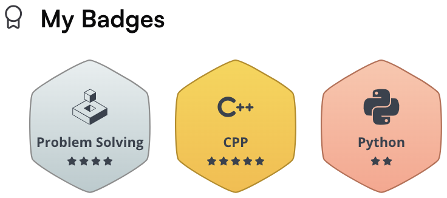

# 👋 Hi there, welcome to my personal corner

My name is Minh, but you can call me **Mine** – and no, it is not about ownership.

The name **Mine** is a shortcut for _“Minh nè”_, which roughly means **“Hey, I am Minh!”**, a cheeky and playful way of introducing myself in Vietnamese.

###### I prefer it pronounced as */Mi-ne/*, rather than */Mi-nə/* or */Min/* (yes, that small detail matters, lol).

## ✨ Fun Facts
- I love clean code, optimization and algorithms 🧩
- I debug with matcha 🍵
- Favorite challenge: making C++ templates behave nicely 😅

So, take a cup of matcha 🍵, explore freely, and maybe you will discover something interesting, or at least slightly optimized. 🚀

## 🧑‍💻 Skills

  

    <strong>Programming</strong> 
     
     
    
  

  

    <strong>OS</strong> 
     
    
  

  

    <strong>Domain</strong> 
     
     
     
    
  

  

    <strong>Tools</strong> 
     
     
     
    
  

  

    <strong>Others</strong> 
     
     
     
    
  

---

## 🎮 Coding Platforms

  
  &nbsp;&nbsp;&nbsp;
  
  &nbsp;&nbsp;&nbsp;
  

## 📊 Stats

  
  &nbsp;&nbsp;
  

